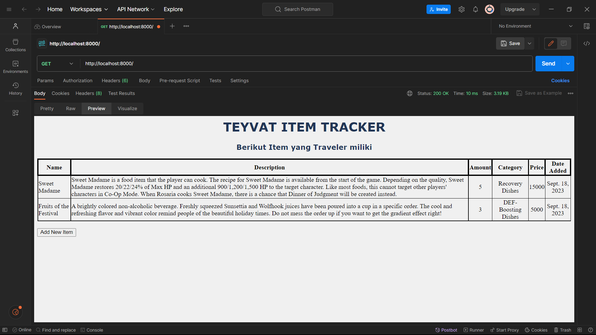
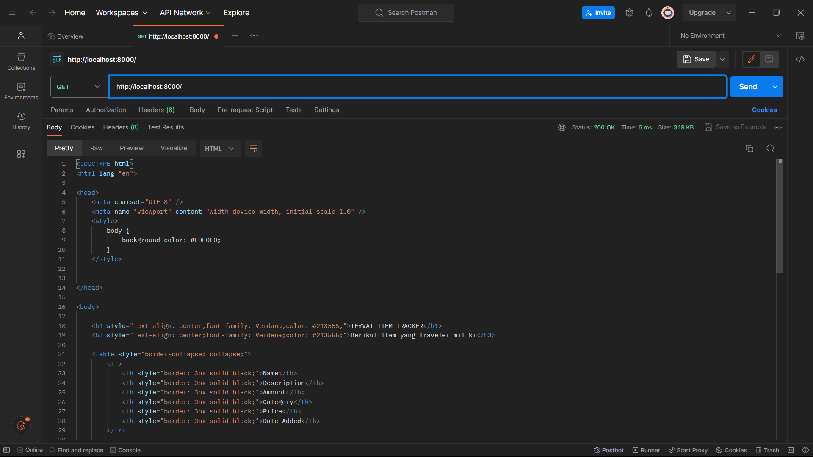
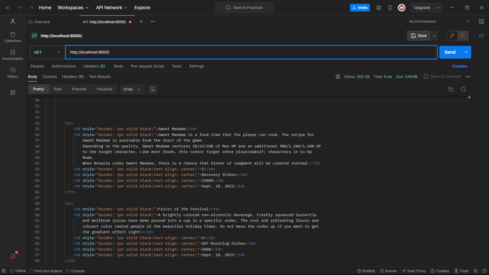
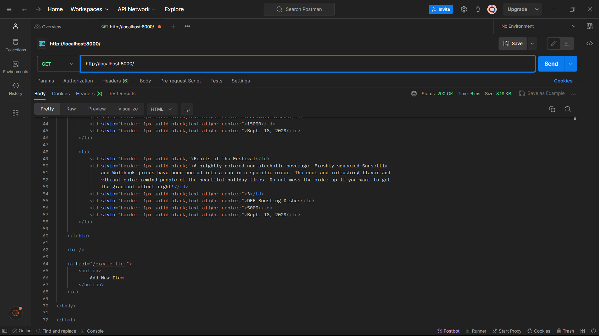
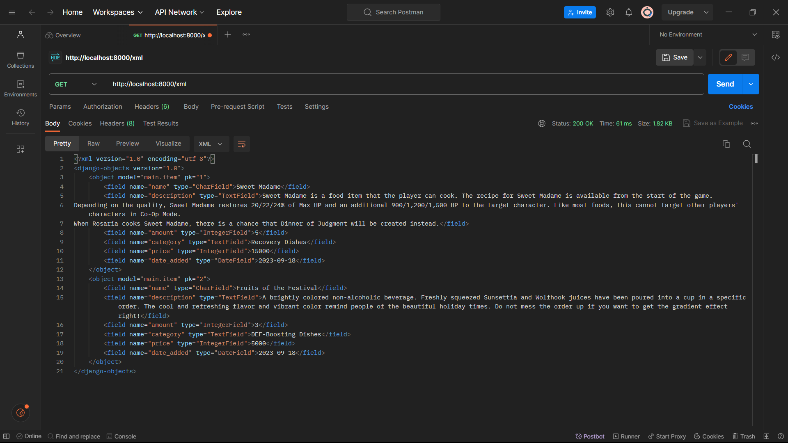
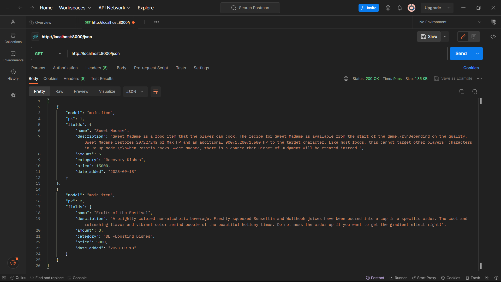
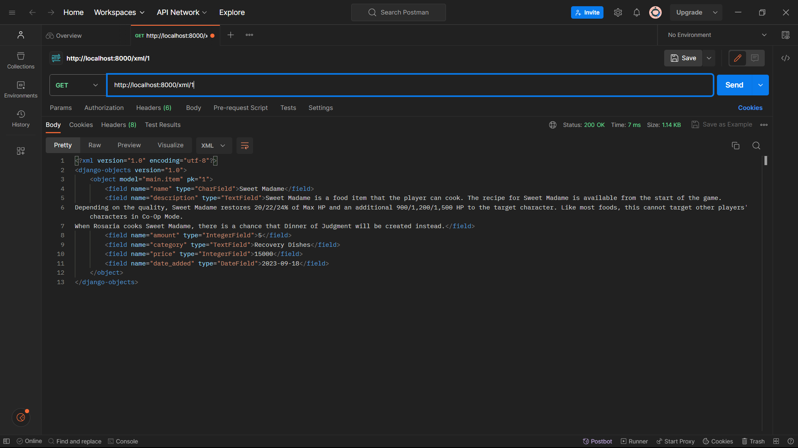
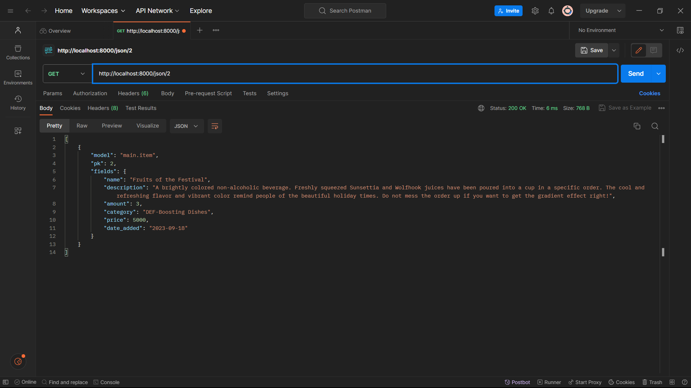
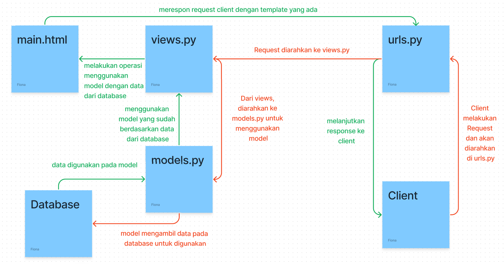

# TUGAS 3
### Fiona Ratu Maheswari
### 2206024575

**Apa perbedaan antara form POST dan form GET dalam Django?**

Terdapat beberapa perbedaan antara form POST dan form GET dalam Django.
1. Pada form POST, data formulir akan dikirmkan ke dalam tubuh permintaan HTML-nya sehingga tidak terlihat pada URL, contohnya adalah www.contoh.com/formulir . Sedangkan pada form GET, data formulir akan dikirimkan ke parameter query string dalam URL sehingga isinya akan terlihat pada URL nya, contohnya adalah www.contoh.com/formulir?nama=John&email=john@contoh.com&password=secretpassword .
2. Jika dilihat dari segi keamanan, form POST lebih aman karena tidak menampilkan datanya pada URL. Sedangkan, form GET lebih berisiko karena menampilkan datanya pada URL.
3. Tidak ada batasan panjang URL pada form POST. Sedangkan pada form GET, terdapat batasan panjang URL.

**Apa perbedaan utama antara XML, JSON, dan HTML dalam konteks pengiriman data?**

1. XML (eXtensible Markup Language):
XML sering digunakan dalam pertukaran data antara aplikasi yang tidak terkait secara langsung. XML memiliki syntax yang kaku dan kompleks, menggunakan tag dengan tanda kurung siku untuk mendefinisikan elemen data dan atribut. Hal ini membuat XML cocok untuk menyimpan data yang memiliki struktur yang kompleks dan memerlukan pemrosesan yang tepat. Contoh penggunaan XML termasuk konfigurasi aplikasi, pertukaran data enterprise, dan penyimpanan data dalam basis data. Parsing XML memerlukan lebih banyak kode karena strukturnya yang kompleks.

2. JSON (JavaScript Object Notation):
JSON memiliki format data yang ringan, mudah dibaca, dan mudah ditulis. Ini sering digunakan dalam komunikasi antara server dan peramban web, pengembangan API, dan penyimpanan data terstruktur. JSON menggunakan format pasangan nama-nilai (key-value pairs) yang sederhana dan mirip dengan objek dalam banyak bahasa pemrograman. Parsing JSON lebih mudah karena formatnya yang ringan dan mirip dengan objek dalam bahasa pemrograman. Hal ini membuat JSON menjadi pilihan umum untuk pertukaran data dalam konteks web dan layanan web.

3. HTML (Hypertext Markup Language):
HTML berperan penting dalam menyusun halaman web dengan menentukan tampilan dan struktur konten yang ditampilkan dalam peramban web. HTML memiliki syntax yang khusus, yang terdiri dari elemen, atribut, dan nilai yang menggambarkan cara elemen-elemen konten diatur dan ditampilkan dalam halaman web. Parsing HTML dilakukan oleh peramban web.

**Mengapa JSON sering digunakan dalam pertukaran data antara aplikasi web modern?**

JSON sering digunakan dalam pertukaran data antara aplikasi web modern karena memiliki beberapa kelebihan sebagai berikut. Pertama, JSON memiliki format yang mudah dibaca, sehingga JSON cocok untuk komunikasi antara server dan peramban web. Kedua, JSON menggunakan struktur data yang mirip dengan objek dalam banyak bahasa pemrograman, sehingga memudahkan pemrosesan data di kedua sisi. Hal ini sangat penting dalam pengembangan aplikasi web yang sering mengirim dan menerima data dalam waktu nyata. Selain itu, hampir semua bahasa pemrograman modern memiliki dukungan bawaan untuk mengurai (parsing) data JSON. JSON juga memungkinkan pengguna untuk menggunakan data dengan kompleksitas yang bervariasi.

**Jelaskan bagaimana cara kamu mengimplementasikan checklist di atas secara step-by-step**

1. Membuat forms.py pada direktori main dan mengisinya dengan atribut apa saja yang akan diminta untuk Item.
2. Melakukan impor modul HttpResponseRedirect, ItemForm, dan reverse. Lalu membuat fungsi create_item dengan menggunakan ItemForm.
3. Mengubah fungsi show_main lebih tepatnya pada bagian context dengan menambahkan 'items': items .
4. Melakukan impor fungsi create_item pada urls.py di direktoti main dan menambahkan path untuk create_item.
5. Membuat berkas create_item.html di direktori main/templates dan mengisinya dengan form yang akan ditampilkan pada halaman create_item.
6. Mengedit main.html agar nantinya data dapat ditampilkan pada halaman main.
7. Melakukan impor HttpResponse dan serializers pada views.py.
8. Membuat fungsi show_xml, show_json, show_xml_by_id, serta show_json_by_id pada views.py.
9. Mengisi fungsi show_xml dengan data = Item.objects.all() lalu return fungsi HttpResponse dimana parameternya content_type="application/xml".
10. Mengisi fungsi show_json dengan data = Item.objects.all() lalu return fungsi HttpResponse dimana parameternya content_type="application/json".
11. Mengisi fungsi show_xml_by_id dengan data = Item.objects.filter(pk=id) lalu return fungsi HttpResponse dimana parameternya content_type="application/xml".
13. Mengisi fungsi show_xml_by_json dengan data = Item.objects.filter(pk=id) lalu return fungsi HttpResponse dimana parameternya content_type="application/json".
14. Melakukan impor fungsi show_xml, show_json, show_xml_by_id, serta show_json_by_id pada urls.py di direktori main.
15. Menambahan path pada urlpatterns pada urls.py.
16. Mencoba kelima fungsi pada postman dengan membuat request baru lalu masukan URL localhost + path fungsi.

**1. Hasil POSTMAN dalam format HTML**

**2. Hasil POSTMAN dalam format XML**

**3. Hasil POSTMAN dalam format JSON**

**4. Hasil POSTMAN dalam format XML by id**

**5. Hasil POSTMAN dalam format JSON by id**

# TUGAS 2
### Fiona Ratu Maheswari
### 2206024575

**Link Adaptable: https://teyvat-item-tracker.adaptable.app/main/**

**- Jelaskan bagaimana cara kamu mengimplementasikan checklist di atas secara step-by-step (bukan hanya sekadar mengikuti tutorial).**

1. Membuat direktori baru bernama Teyvat_Item_Tracker di direktori lokal dan repository baru berjudul sama di GitHub.
2. Inisiasi Git pada direktori Teyvat_Item_Tracker dan menghubungkan direktori lokal dengan repository GitHub.
3. Membuat virtual environment terlebih dahulu.
4. Melakukan instalasi dependencies pada virtual environment.
5. Mengizinkan akses kepada semua host.
6. Menambahkan .gitignore pada direktori.
7. Membuat aplikasi baru bernama main.
8. Menambahkan aplikasi main ke dalam proyek.
9. Membuat folder templates lalu membuat main.html.
10. Membuat model Item pada models.py dengan atribut name, description, amount, dan category.
11. Membuat fungsi show_main pada views.py yang berisi data yang akan ditampilkan.
12. Melakukan routing URL aplikasi main dengan membuat berkas urls.py lalu mengisinya dengan path menggunakan show_main.
13. Melakukan routing  URL Proyek menggunakan fungsi include dan menambahkan rute URL ke dalam urlpatterns.
14. Membuat unit test seperti pada tutorial dan menjalankan test.
15. Melakukan push ke repository GitHub.

**- Buatlah bagan yang berisi request client ke web aplikasi berbasis Django beserta responnya dan jelaskan pada bagan tersebut kaitan antara urls.py, views.py, models.py, dan berkas html.**

**- Jelaskan mengapa kita menggunakan virtual environment? Apakah kita tetap dapat membuat aplikasi web berbasis Django tanpa menggunakan virtual environment?**

Kita sebaiknya menggunakan virtual environment agar proyek-proyek lainnya yang kita miliki tidak terganggu dan agar dependencies yang kita gunakan pada proyek-proyek yang kita miliki tidak konflik versi.

**- Jelaskan apakah itu MVC, MVT, MVVM dan perbedaan dari ketiganya.**

**MVC** adalah sebuah pendekatan arsitektur perangkat lunak yang digunakan dalam pengembangan aplikasi dimana **Controller** sebagai penghubungnya.
Model: Model mengelola data aplikasi, berkomunikasi dengan database, dan menjalankan logika bisnis.
View: View mengatur tampilan aplikasi dan tidak memiliki logika bisnis.
Controller: Controller menerima input dari pengguna, memprosesnya, dan memutuskan tindakan yang akan diambil berdasarkan input tersebut.

**MVT** adalah sebuah pendekatan arsitektur perangkat lunak yang digunakan dalam pengembangan aplikasi dimana **Template** sebagai penghubungnya.
Model: Komponen yang berhubungan dengan data dan logika bisnis.
View: View bertanggung jawab untuk menampilkan data kepada pengguna.
Template: Berisi kode HTML dengan syntax template yang disediakan dan digunakan untuk mengatur tampilan aplikasi.

**MVVM** adalah sebuah pendekatan arsitektur perangkat lunak yang digunakan dalam pengembangan aplikasi dimana **Template** sebagai penghubungnya.
Model: Komponen yang berhubungan dengan data dan logika bisnis.
View: View bertanggung jawab untuk menampilkan data kepada pengguna.
ViewModel: ViewModel berisi logika tampilan (UI logic) yang menghubungkan Model dengan View. Ini memungkinkan tampilan untuk berkomunikasi dengan Model tanpa harus mengetahui detailnya.

**Perbedaan utama MVC, MVT, dan MVVM:**
MVC akan menerima input pada Controller lalu diarahkan ke view (Controller menjadi penghubung view dengan model), sedangkan pada MVT dan MVVM akan menerima input dan diarahkan ke view langsung. Lalu untuk MVT sendiri, setelah view mendapatkan data dari model, maka view akan menyalurkan data untuk tampilan ke template, lalu template akan memberikan respon ke user melalui urls. Khusus MVVM, ViewModel menjadi penghubung antara view dengan model.